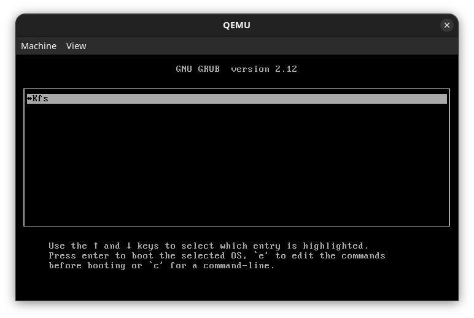
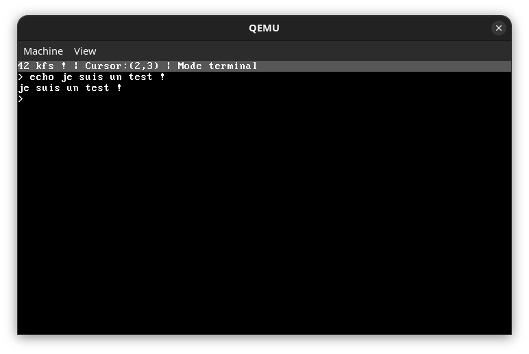
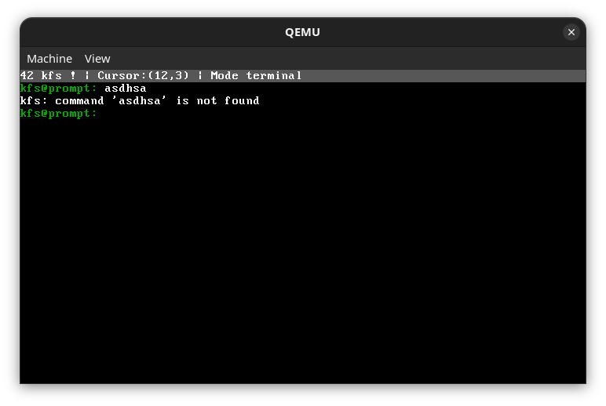
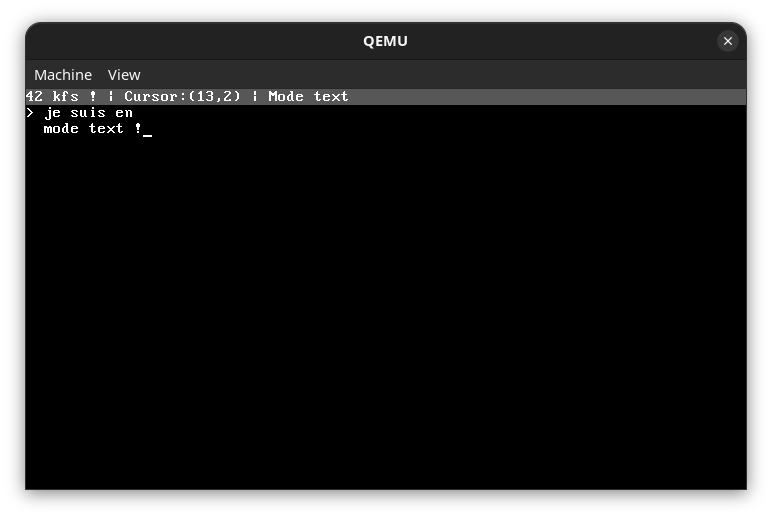

<h1 align="center"><strong>🐧 KFS — Kernel From Scratch</strong></h1>

<p align="center">
  <strong>Développement d'un noyau de système d'exploitation minimaliste x86</strong><br>
  Projet Système de l'école 42 | C • Assembleur • Architecture OS
</p>

---

## 📖 Vue d'ensemble

**KFS (Kernel From Scratch)** est un projet d'exploration des couches les plus basses de l'informatique. L'objectif est de concevoir et de démarrer un noyau de système d'exploitation entièrement fonctionnel bare-metal, sans s'appuyer sur la bibliothèque standard du C (libc) ni sur aucun système sous-jacent.

Ce projet relève plusieurs défis techniques majeurs d'ingénierie système :

1. **Séquence de boot et architecture x86** — Transition de l'amorçage vers le kernel.
2. **Gestion matérielle de base** — Configuration de la GDT.
3. **Interfaçage I/O** — Pilotes d'affichage VGA et interception matérielle du clavier.
4. **Multitâche basique** — Implémentation d'un système de swap de terminaux (TTY).

---

## 🖼️ Aperçus


*Séquence de démarrage du kernel avec GRUB*


*Utilisation de l'interpréteur de commandes basiques*


*Changement de terminal virtuel avec d'autres couleurs*


*Mode saisie libre (sans contrainte d'interpréteur)*

---

## ✨ Fonctionnalités

### Système de base
- ✅ **Bootloader** — Séquence de démarrage configurée pour charger le noyau.
- ✅ **Driver VGA Mode Texte** — Affichage à l'écran avec gestion directe de la mémoire vidéo, des couleurs et du curseur.
- ✅ **Gestion des interruptions matérielles** — Configuration de la GDT (Global Descriptor Table).
- ✅ **Driver Clavier (PS/2)** — Interception matérielle (PIC) et traduction des scancodes en caractères lisibles.

### Fonctionnalités avancées
- 🔄 **Swap de Terminaux (TTY)** — Gestion de plusieurs terminaux virtuels indépendants avec basculement à la volée. Chaque terminal conserve son propre buffer et la position de son curseur.
- 💻 **Interpréteur de Commandes** — Un shell intégré permettant d'interagir avec le système et d'exécuter des instructions matérielles.
- 📝 **Mode Saisie Libre (Raw Text Mode)** — Un mode d'édition alternatif permettant d'écrire librement sur tout l'écran, sans les limitations du shell (façon éditeur de texte basique).
- ⚡ **Libc réécrite** — Implémentation "from scratch" des fonctions essentielles (`strlen`, `strcmp`, gestion mémoire) optimisées pour le kernel.

---

## 🎮 Utilisation

### Compilation & Lancement

Prérequis : **nix, Make**

```bash
# Cloner le dépôt
git clone https://github.com/agtdbx/kfs.git
cd kfs

# Activé l'environement de dev
nix develop --extra-experimental-features nix-command --extra-experimental-features flakes

# Compiler le kernel
make

# Lancer le système d'exploitation via l'émulateur QEMU
make run
```

### Exemples de commandes du Shell
- `clear` : Nettoie l'écran du terminal courant
- `echo` : Affiche ce qui est donner en paramètre. L'option -n ne met pas de retour à la ligne.
- `gdt` : Affiche la gdt.

### Controls
Touches         | Action                                          |
----------------|-------------------------------------------------|
L-CTRL + TAB    | Changement de terminal virtuel                  |
L-SHIFT + TAB   | Basculer entre le Shell et le Mode Saisie Libre |
L-CTRL + HOME   | Déplacer le curseur au début du terminal        |
L-CTRL + END    | Déplacer le curseur à la fin du terminal        |
L-CTRL + DELETE | Effacer intégralement le terminal courant       |

---

## 🧠 Aspects techniques

### De l'Assembleur au C
Le point d'entrée du noyau est rédigé en Assembleur. Ce code de bas niveau se charge de configurer la pile (stack) et de passer la main au code C (le point d'entrée `kmain` du kernel). Toute la logique applicative est ensuite gérée en C pur, en environnement *freestanding*.

### Gestion de la mémoire et affichage
L'affichage écrit directement dans la mémoire vidéo (VGA text buffer mappé à l'adresse physique `0xB8000`). La gestion du "Swap de terminal" nécessite d'allouer de la mémoire pour sauvegarder l'état de l'écran pour chaque TTY inactif, et de copier instantanément ces données vers la VRAM lors d'un basculement de contexte.

---

## 📂 Structure du projet

```text
src/
├── boot/
│   ├── bootloader.asm  # Code de démarrage du kernel et GDT
│   └── linker.ld       # Définition de la structure de la mémoire
└── kernel/
    ├── commands/   # Gestion de l'interpréteur de commandes
    ├── inputs/     # Gestions du clavier et du curseur
    ├── libs/       # Fonctions standards (Libc) et I/O
    ├── printk/     # Implémentation d'un printf bare-metal
    ├── terminal/   # Gestion des buffers de terminaux virtuels
    ├── colors.h    # Définition des couleurs VGA
    ├── define.h    # Types standards
    └── kernel.c    # Point d'entrée principal (kmain)
```

---

## 🎯 Objectifs pédagogiques (42)

Ce projet exigeant vise à maîtriser :

- ✅ Compréhension fine de l'architecture matérielle (x86).
- ✅ Maîtrise de l'Assembleur et du C sans aucune abstraction système.
- ✅ Manipulation directe de la mémoire physique et des ports d'E/S (I/O ports).

---

## 📚 Ressources utiles

- [OSDev.org](https://wiki.osdev.org/Main_Page) - La référence absolue pour le développement d'OS
- [Documentation Multiboot](https://www.gnu.org/software/grub/manual/multiboot/multiboot.html)

---

## 👥 Auteur
**Auguste Deroubaix** (agtdbx) 🔗 [GitHub](https://github.com/agtdbx) • 🎓 Étudiant 42
